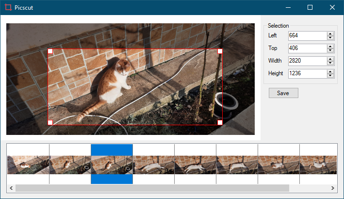

# Picscut

Crop multiple images at the same time. Useful when you want to cut something from a bunch of pictures which share a common pattern (e.g. a window from many screenshots).

## How to use

1. Drag & drop picture files to the bottom pictures list bar.
1. Select the cropped area using the red rectangle (you can also manually adjust the selections bounds using the right panel)
1. Click `Save`. For each picture, the result is saved in a `cropped` directory located in the same path as the picture.

## Screenshots

</img>

